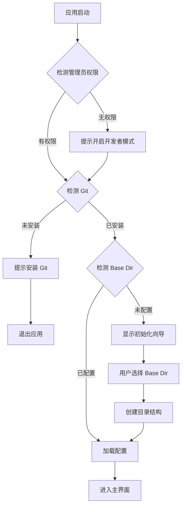

# 启动流程与初始化

## 概述

应用启动时需完成环境检测、权限验证和初始化配置。

## 启动流程



## 权限检测

### Windows 管理员权限

```typescript
// src/main/services/platform.ts
import isElevated from 'is-elevated';

export async function checkElevation(): Promise<boolean> {
  if (process.platform !== 'win32') return true;
  return await isElevated();
}

export function getDeveloperModeGuide(): string {
  return '设置 → 更新和安全 → 开发者选项 → 开启「开发人员模式」';
}
```

### Git 检测

```typescript
// src/main/services/git.ts
import { execSync } from 'child_process';

export function checkGitInstalled(): boolean {
  try {
    execSync('git --version', { stdio: 'ignore' });
    return true;
  } catch {
    return false;
  }
}

export function getGitInstallGuide(): Record<string, string> {
  return {
    win32: 'https://git-scm.com/download/win',
    darwin: '运行: brew install git',
    linux: '运行: sudo apt install git 或 sudo yum install git'
  };
}
```

## 初始化向导

### 界面设计

初始化向导为单页面模态框，包含：

1. **欢迎信息** - 简要介绍应用功能
2. **目录选择器** - 选择或创建 Manager Base Dir
3. **确认按钮** - 完成初始化

### 目录结构创建

```typescript
// src/main/services/config.ts
import fs from 'fs-extra';
import path from 'path';

export async function initBaseDir(baseDir: string): Promise<void> {
  const dirs = [
    'config',
    'config/platforms',
    'config/presets',
    'skills',
    'rules'
  ];

  for (const dir of dirs) {
    await fs.ensureDir(path.join(baseDir, dir));
  }

  // 创建默认配置
  const configPath = path.join(baseDir, 'config', 'config.yaml');
  if (!await fs.pathExists(configPath)) {
    await fs.writeFile(configPath, 'version: 1\n');
  }

  // 复制内置预设
  await copyBuiltinPresets(baseDir);
}
```

## IPC 接口

| Channel | Direction | 参数 | 返回值 |
|---------|-----------|------|--------|
| `app:check-elevation` | Renderer → Main | - | `boolean` |
| `app:check-git` | Renderer → Main | - | `boolean` |
| `app:get-base-dir` | Renderer → Main | - | `string \| null` |
| `app:set-base-dir` | Renderer → Main | `baseDir: string` | `void` |
| `app:init-base-dir` | Renderer → Main | `baseDir: string` | `void` |
