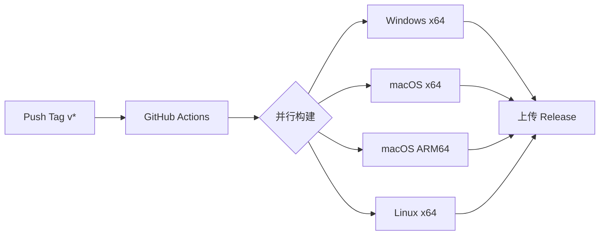

# CI/CD 构建

## 概述

使用 GitHub Actions 自动构建和发布跨平台安装包。

## 构建流程



## 触发条件

仅当推送 `v` 开头的标签时触发构建：

```yaml
on:
  push:
    tags:
      - 'v*'
```

## GitHub Actions 工作流

```yaml
# .github/workflows/release.yml

name: Build and Release

on:
  push:
    tags:
      - 'v*'

jobs:
  build:
    strategy:
      matrix:
        include:
          - os: windows-latest
            platform: win
          - os: macos-latest
            platform: mac-x64
          - os: macos-14
            platform: mac-arm64
          - os: ubuntu-latest
            platform: linux

    runs-on: ${{ matrix.os }}

    steps:
      - name: Checkout
        uses: actions/checkout@v4

      - name: Setup Node.js
        uses: actions/setup-node@v4
        with:
          node-version: '20'

      - name: Setup pnpm
        uses: pnpm/action-setup@v3
        with:
          version: 9

      - name: Install dependencies
        run: pnpm install

      - name: Build
        run: pnpm build
        env:
          GH_TOKEN: ${{ secrets.GITHUB_TOKEN }}

      - name: Upload artifacts
        uses: actions/upload-artifact@v4
        with:
          name: release-${{ matrix.platform }}
          path: dist/*.{exe,dmg,AppImage}

  release:
    needs: build
    runs-on: ubuntu-latest

    steps:
      - name: Download all artifacts
        uses: actions/download-artifact@v4
        with:
          path: artifacts

      - name: Create Release
        uses: softprops/action-gh-release@v1
        with:
          files: artifacts/**/*
          draft: false
          prerelease: false
        env:
          GITHUB_TOKEN: ${{ secrets.GITHUB_TOKEN }}
```

## electron-builder 配置

```yaml
# electron-builder.yml

appId: com.skillsmanager.app
productName: Skills Manager
directories:
  output: dist
  buildResources: resources

files:
  - "dist-electron/**/*"
  - "dist/**/*"

win:
  target:
    - target: nsis
      arch: [x64]
  icon: resources/icon.ico
  requestedExecutionLevel: requireAdministrator

mac:
  target:
    - target: dmg
      arch: [x64, arm64]
  icon: resources/icon.icns
  hardenedRuntime: true
  gatekeeperAssess: false

linux:
  target:
    - target: AppImage
      arch: [x64]
  icon: resources/icon.png
  category: Development

nsis:
  oneClick: false
  allowToChangeInstallationDirectory: true
  installerIcon: resources/icon.ico
  uninstallerIcon: resources/icon.ico

dmg:
  contents:
    - x: 130
      y: 220
    - x: 410
      y: 220
      type: link
      path: /Applications
```

## 构建产物

| 平台 | 文件名 | 说明 |
|------|-------|------|
| Windows | `SkillsManager-x.x.x-win.exe` | NSIS 安装程序 |
| macOS x64 | `SkillsManager-x.x.x-mac-x64.dmg` | Intel Mac |
| macOS ARM64 | `SkillsManager-x.x.x-mac-arm64.dmg` | Apple Silicon |
| Linux | `SkillsManager-x.x.x-linux.AppImage` | 通用 AppImage |

## 版本管理

版本号遵循语义化版本规范 (SemVer)：

```bash
# 发布新版本
pnpm version patch  # 1.0.0 -> 1.0.1
pnpm version minor  # 1.0.0 -> 1.1.0
pnpm version major  # 1.0.0 -> 2.0.0

# 推送标签触发构建
git push origin v1.0.1
```

## 签名说明

> [!WARNING]
> 由于没有 Apple 开发者账号，macOS 版本未签名，用户需手动绕过 Gatekeeper。

详见 [README.md](../../README.md) 中的 macOS 安装说明。
